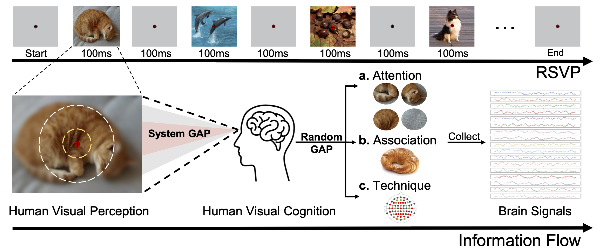

# Uncertainty-aware Blur Prior (UBP)

## Table of Contents
- [Introduction](#introduction)
- [Repo Architecture](#repo-architecture)
- [Environment Setup](#environment-setup)
- [Data Preparation](#data-preparation)
- [Run](#run)
- [Acknowledgement](#acknowledgement)

## Introduction
This is the official implementation for [Bridging the Vision-Brain Gap with an Uncertainty-Aware Blur Prior](https://arxiv.org/abs/2503.04207) (CVPR 2025) with various brain and CLIP encoders.

<p align="center">

</p>


## Repo Architecture
```
UBP/                           # Root directory
├── README.md
├── base                       # Core implementation files
│   ├── data.py                # Data loading
│   ├── eeg_backbone.py        # EEG encoder backbone implementation
│   ├── inpating_data.py       # Inpainting data module for preprocessing
│   └── utils.py               # Utility functions
├── configs
│   ├── baseline.yaml          # Configuration for baseline experiments
│   └── ubp.yaml               # Configuration for UBP experiments
├── data                       # Directory for datasets
│   └── things-eeg
│       ├── Image_feature      # Pre-extracted image features
│       ├── Image_set          # Original image dataset
│       ├── Image_set_Resize   # Resized image dataset
│       ├── Preprocessed_data_250Hz_whiten # Preprocessed EEG data (whitened)
│       └── Raw_data
├── exp                        # Directory for experiment results
├── main.py                    # Main script for running experiments
├── preprocess
│   ├── process_eeg_whiten.py  # Script to preprocess and whiten EEG data
│   └── process_resize.py      # Script to resize image dataset
├── requirements.txt           # List of required Python packages
└── scripts
    ├── bash_preprocess.sh     # Bash script for preprocessing data
    └── exp.sh                 # Bash script for running experiments
```
## Environment Setup
- Python 3.8.19
- Cuda 12.0
- PyTorch 2.4.1
- Required libraries are listed in `requirements.txt`.

```
pip install -r requirements.txt
```

## Data Preparation
1. Download the Things-EEG dataset from the [OSF repository](https://osf.io/anp5v/files/osfstorage) and put them in the `data` dir. (We provided the processed data on [BaiduNetdisk](https://pan.baidu.com/s/1p_5EtKmojmpwXr2_LoaxTA?pwd=huhe))

2. Resize the downloaded images using the provided script:

```
python preprocess/process_resize.py
```

3. Convert the data to .pt format using the preprocessing script for all subjects:

```
/bin/bash scripts/bash_preprocess.sh
```

Finally, we have the directory tree:
```
|-- data
    |-- things-eeg
        |-- Image_set
        |-- Image_set_Resize
        |-- Raw_data
        |-- Preprocessed_data_250Hz_whiten
```
## Run
To run the experiments using the provided configurations, execute:
```
/bin/bash scripts/exp.sh
```

```
brain_backbone="EEGProjectLayer"
vision_backbone="RN50"
i="01"
seed=0
python main.py --config configs/ubp.yaml --subjects sub-$i --seed $seed --exp_setting intra-subject --brain_backbone $brain_backbone --vision_backbone $vision_backbone --epoch 50 --lr 1e-4;

```
## Acknowledgement
We acknowledge the contributions of the following datasets:
- [A large and rich EEG dataset for modeling human visual object recognition](https://www.sciencedirect.com/science/article/pii/S1053811922008758) [THINGS-EEG]
- [
THINGS-data, a multimodal collection of large-scale datasets for investigating object representations in human brain and behavior](https://pubmed.ncbi.nlm.nih.gov/36847339/) [THINGS-MEG]

The code is inspired by prior awesome works on neural decoding tasks:
- [Decoding Natural Images from EEG for Object Recognition](https://github.com/eeyhsong/NICE-EEG) [ICLR 2024]
- [Visual Decoding and Reconstruction via EEG Embeddings with Guided Diffusion](https://github.com/dongyangli-del/EEG_Image_decode) [NeurIPS 2024]
- [Decoding Visual Neural Representations by Multimodal Learning of Brain-Visual-Linguistic Features](https://github.com/ChangdeDu/BraVL)  [TPAMI 2023]

Uncertainy-aware work related to multimodality:
- [Trusted multi-view classification with dynamic evidential fusion](https://github.com/hanmenghan/TMC) [TPAMI 2022]
- [Provable Dynamic Fusion for Low-Quality Multimodal Data](https://github.com/QingyangZhang/QMF) (ICML 2023)
- [Reliable Conflictive Multi-View Learning](https://github.com/jiajunsi/RCML) (AAAI 2024, Outstanding Paper)

## Citation
If you find our work helpful, please cite:
```bibtex
@InProceedings{Wu2025UBP,
    title = {Bridging the Vision-Brain Gap with an Uncertainty-Aware Blur Prior},
    author = {Wu, Haitao and Li, Qing and Zhang, Changqing and He, Zhen and Ying, Xiaomin},
    booktitle = {Proceedings of the IEEE/CVF Conference on Computer Vision and Pattern Recognition (CVPR)},
    year = {2025}
}
```


## Contact us
For any additional questions, feel free to email wuhaitao@tju.edu.cn .


<!-- ## Citation
```

``` -->